# Autonomous Anomaly Defense — Architecture

> **One-liner:** Cheap ESP32 sniffers watch an industrial network for anomalies. When something unknown appears, the raw capture goes to an AI agent that identifies the attack and *writes a C filter*. A replay test proves the filter works (catches the attack, blocks nothing legit), and only then is it pushed OTA to the fleet. No human in the loop.

> **The thesis:** *Give the industry an engineer.* The agent isn't a copilot suggesting fixes — it's an autonomous layer that detects → analyzes → writes code → verifies → deploys.

Deauth is just the first example. The system is built to generalize to **any radio/bus anomaly** (deauth, disassoc, beacon flood, auth flood, Modbus injection, rogue BLE…).

---

## 1. Why this wins

Three things judges reward, and this design has all three *naturally* (not bolted on):

| Criterion | How we hit it |
|---|---|
| **Autonomy** (a layer, not a copilot) | Full loop with zero human approval: trigger → agent → verify → OTA |
| **Verification** (a hard oracle) | Replay test: attack pcap (must catch ~100%) + benign pcap (must block 0). Machine-scored in seconds. |
| **Clarity** (if we can't follow it, we can't credit it) | The **dashboard** visualizes the whole loop live. This is the money shot. |

**The oracle is the core.** Attack = data (hex frames). Defense = code (a C predicate over frame bytes). Verification = replay both labeled sets and count TPR/FPR. That's the `write → run → test → fix` loop, applied to network security.

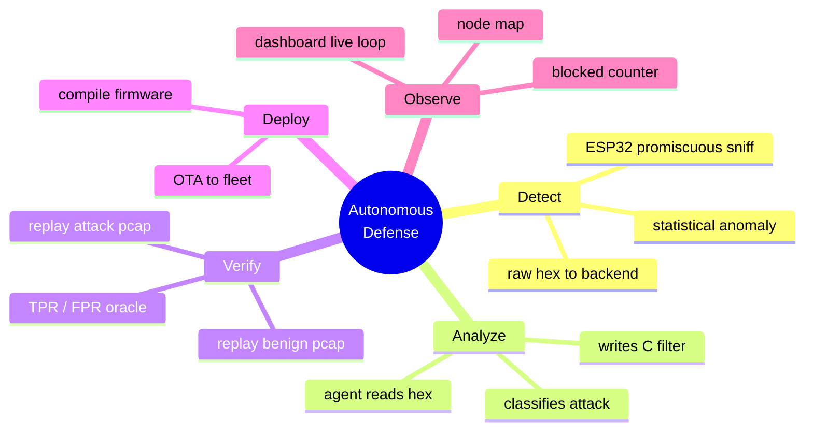

---

## 2. System architecture (high level)

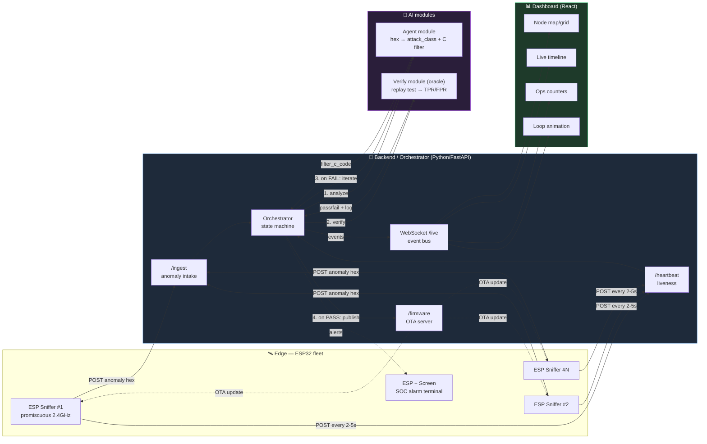

**Your ownership = the SPINE + WEB.** AI team gives you two black-box functions with fixed contracts. Hardware gives you devices that POST to your endpoints and accept OTA. You wire it all together and make it visible.

---

## 3. The autonomous loop (the whole demo)

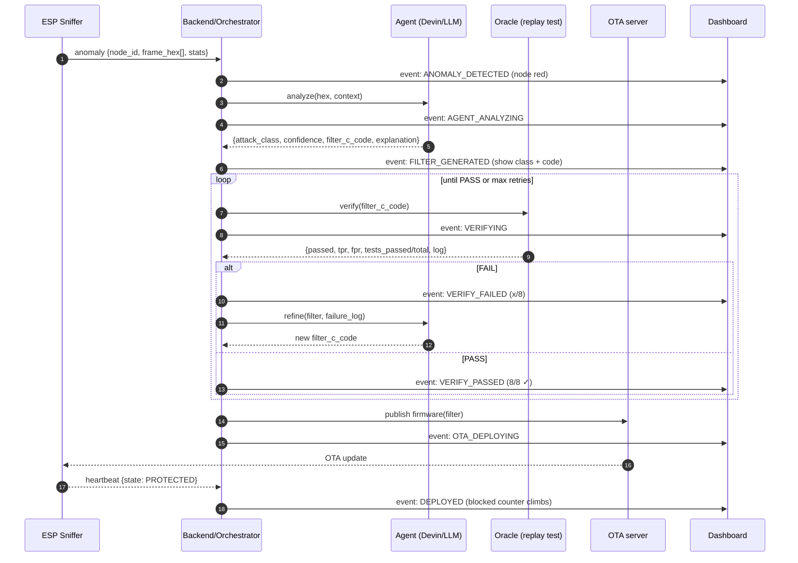

**Critical:** no human between AG and FW. A human clicking "approve" = you lose on *"copilot, not a layer."*

---

## 4. Data contracts — FREEZE THESE IN HOUR 1

This is the single most important thing. Agree these 4 schemas before anyone writes code. Then everyone builds against mocks and nobody blocks anyone.

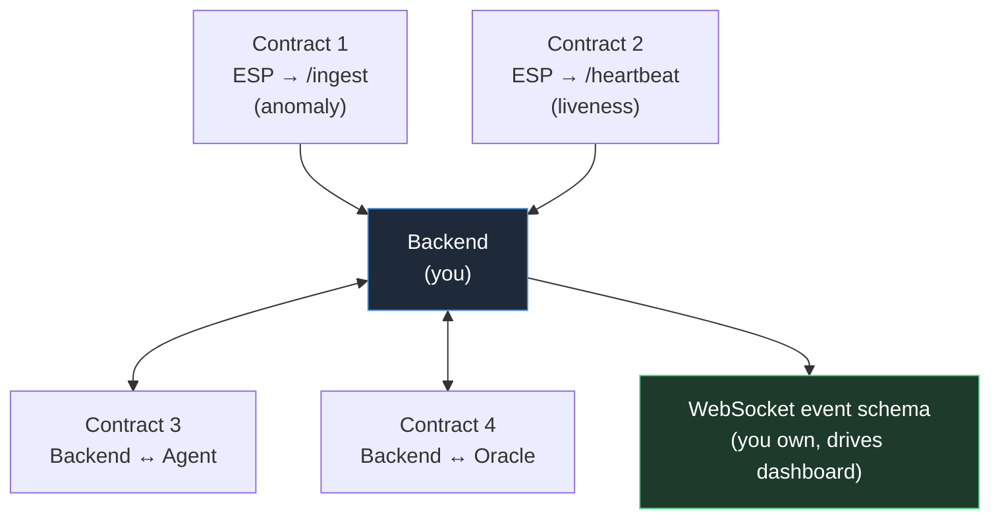

### Contract 1 — ESP → `/ingest` (anomaly)
```json
{
  "node_id": "esp-03",
  "timestamp": 1690000000.123,
  "frame_hex": ["c0003a01ffffffff...", "..."],
  "rssi": -52,
  "bssid": "34:fa:9f:5d:24:a9",
  "sender_mac": "02:00:00:00:00:01",
  "anomaly_stats": { "frame_type": "mgmt", "subtype": 12, "channel": 11, "count_in_window": 240, "window_ms": 1000 },
  "guessed_type": null
}
```

### Contract 2 — ESP → `/heartbeat` (every 2–5s)
```json
{ "node_id": "esp-03", "timestamp": 1690000000.0, "state": "NORMAL", "stats": { "frames_seen": 10432, "blocked": 0, "fw_version": "v1" } }
```
`state ∈ { NORMAL, ALERT, PROTECTED, UPDATING, OFFLINE }`

### Contract 3 — Backend ↔ Agent
```json
// in:
{ "frame_hex": ["..."], "anomaly_stats": {}, "prev_filter": null, "failure_log": null }
// out:
{ "attack_class": "deauth_flood", "confidence": 0.94,
  "filter_c_code": "bool block_frame(const uint8_t* f, size_t n){ ... }",
  "explanation": "802.11 mgmt subtype 12 flood ..." }
```

### Contract 4 — Backend ↔ Oracle
```json
// in:
{ "filter_c_code": "bool block_frame(...)" }
// out:
{ "passed": true, "tpr": 1.0, "fpr": 0.0, "tests_total": 8, "tests_passed": 8, "log": "..." }
```

### WebSocket `/live` event (you own this — it drives the dashboard)
```json
{ "type": "VERIFY_PASSED", "node_id": "esp-03", "ts": 1690000000.5,
  "payload": { "tpr": 1.0, "fpr": 0.0, "tests": "8/8", "attack_class": "deauth_flood" } }
```
Event types: `NODE_UP, NODE_DOWN, ANOMALY_DETECTED, AGENT_ANALYZING, FILTER_GENERATED, VERIFYING, VERIFY_FAILED, VERIFY_PASSED, OTA_DEPLOYING, DEPLOYED, FRAME_BLOCKED`.

---

### Contract 5 — Gmail threat review

Email security is isolated from the frozen ESP event stream. Gmail emits mailbox history IDs through
Cloud Pub/Sub; the backend resolves added messages, persists a durable analysis record, and emits a
dedicated `/v1/email/live` event.

```json
{
  "type": "EMAIL_FLAGGED",
  "analysis_id": 42,
  "ts": 1690000000.5,
  "message": "Potential credential phishing requires review"
}
```

Analysis state: `QUEUED → ANALYZING → CLEAR | PENDING_REVIEW | FAILED → REVIEWED`.
Agent verdict: `CLEAR | FLAGGED | INCONCLUSIVE`. `FLAGGED` and `INCONCLUSIVE` require a human
decision; no email is deleted, moved, or reported as Spam automatically.

`GET /v1/email/messages?limit=50&page_token=...` browses Gmail history in 1–50 message pages and
returns `next_page_token`, independently of the automatic monitoring mode. `POST /v1/email/import`
accepts either selected Gmail IDs as
`{ "message_ids": ["abc"], "limit": null }` or a no-preview quick import as
`{ "message_ids": [], "limit": 10 }`. It returns
`{ "scanned": 1, "imported": 1, "duplicates": 0 }`. Imported Gmail message IDs use the same
durable deduplication and analysis queue as push events; quick import skips full Gmail downloads
for IDs already present in the queue.

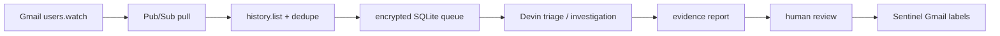

---

## 5. Backend — build order (so you never block on the team)

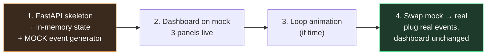

**Key trick:** a fake-event generator emits synthetic loop events every few seconds (`NODE_UP → ANOMALY → ANALYZING → 8/8 → DEPLOYED`). This runs your entire dashboard *before ESP or agent exist*. At the end you swap the source; the dashboard never changes.

### Orchestrator state machine (per anomaly)
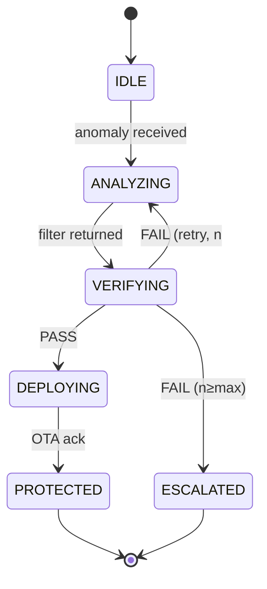

### ESP node liveness (dashboard tile color)
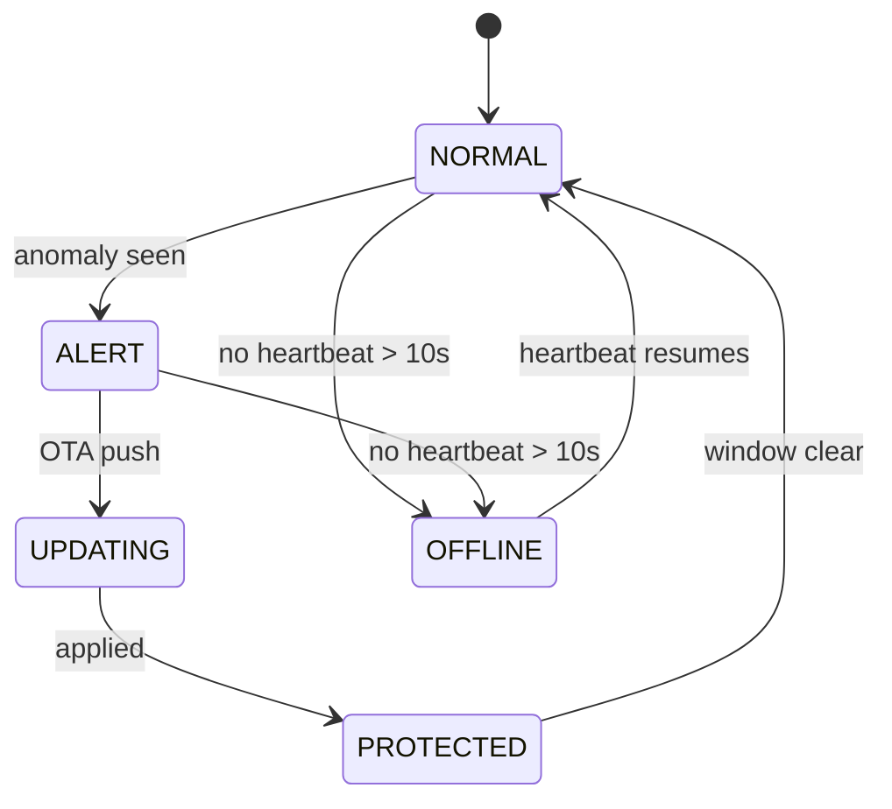

### Endpoints
| Method | Path | Purpose |
|---|---|---|
| POST | `/ingest` | anomaly intake (Contract 1) |
| POST | `/heartbeat` | node liveness (Contract 2) |
| GET | `/firmware/{node_id}` | OTA fetch latest firmware |
| GET | `/nodes` | current fleet snapshot (dashboard bootstrap) |
| WS | `/live` | event stream to dashboard |

---

## 6. Dashboard — the money shot

Three panels + one animation. Built on mock data from hour 1.

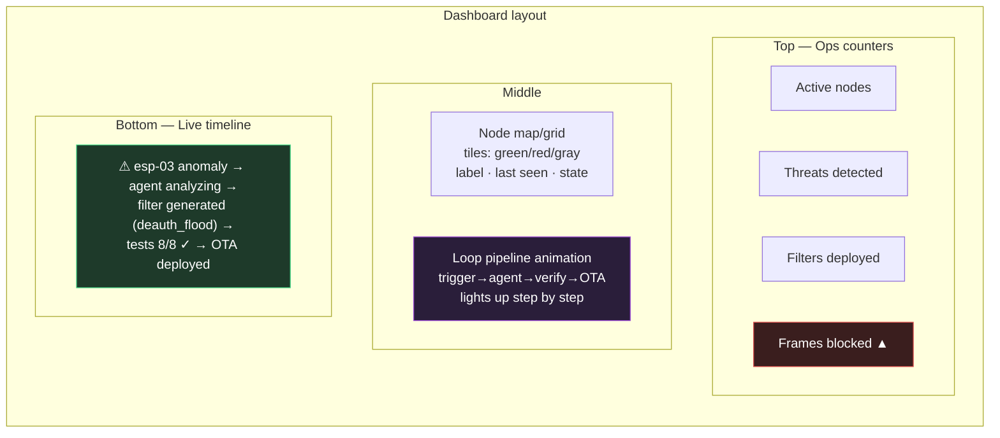

- **Node grid** — one tile per ESP. Color by heartbeat state. Red when under attack. This proves "fleet."
- **Live timeline** — the loop as a scrolling feed. *This is the visualization of autonomy + verification.*
- **Ops counters** — active nodes, threats, filters deployed, blocked frames (a climbing counter reads as "working right now").
- **Loop animation** — pipeline `trigger → agent → verify → OTA` lighting up in sequence. Highest stage ROI if time allows.

---

## 7. Work split (5 people, ~19h)

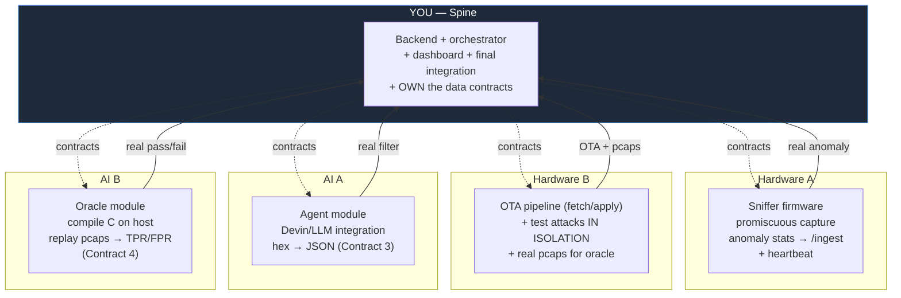

Everyone builds a **vertical slice on mocks**; integrate at the end. Your second job (besides code) = enforce the contracts.

---

## 8. Timeline

```mermaid
gantt
    title 19h plan (rough)
    dateFormat HH
    axisFormat %Hh
    section All
    Contracts + stack + repo (NO SKIP)   :done, c1, 00, 1h
    section Parallel (on mocks)
    Backend + dashboard on fake data      :active, b1, 01, 7h
    Sniffer capture (verify FIRST night)  :h1, 01, 7h
    Agent module vs contract              :a1, 01, 7h
    Oracle module standalone              :o1, 01, 7h
    section Integrate
    ESP→backend (heartbeat visible)       :i1, 08, 2h
    + agent                               :i2, 10, 1h
    + oracle                              :i3, 11, 1h
    + OTA                                 :i4, 12, 1h
    section Demo-harden
    Full loop end-to-end once             :d1, 13, 2h
    2nd unknown attack live               :d2, 15, 1h
    Dashboard polish                      :d3, 16, 1h
    section Pitch
    Dry run + buffer                      :p1, 17, 2h
```

---

## 9. Scope discipline — cut lines

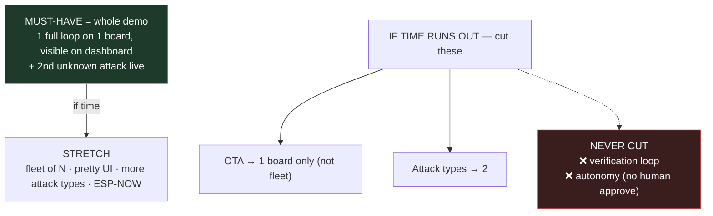

The **generalization proof** kills the "wired to one prepared example" objection: train/demo on deauth, then fire a *different* attack (beacon flood / disassoc) live and show the agent handles the unknown.

---

## 10. Safety / legality (say this to judges — it shows maturity)

- **Detection is 100% passive and legal.** Building the detector is fully fine.
- **Generating attacks is a real attack** → keep it isolated:
  - Prefer replaying from **pcap files** or crafting frames programmatically — no live over-the-air attack.
  - If live is required: one dedicated ESP attacks *only your own victim ESP*, low power, your channel, your hardware.
  - **Never** deauth the venue/hackathon WiFi — breaks other teams, likely against venue rules, possibly illegal.
- Keep the **oracle's test sets independent** — the humans prepare the attack/benign pcaps so the agent can't game them.

---

## 11. Generalization — same skeleton, other domains

> Pattern: *ESP sniffs a signal it doesn't fully understand → agent reconstructs structure & builds a detector as code → replay-verify on labeled captures → OTA → next unknown, loop repeats.*

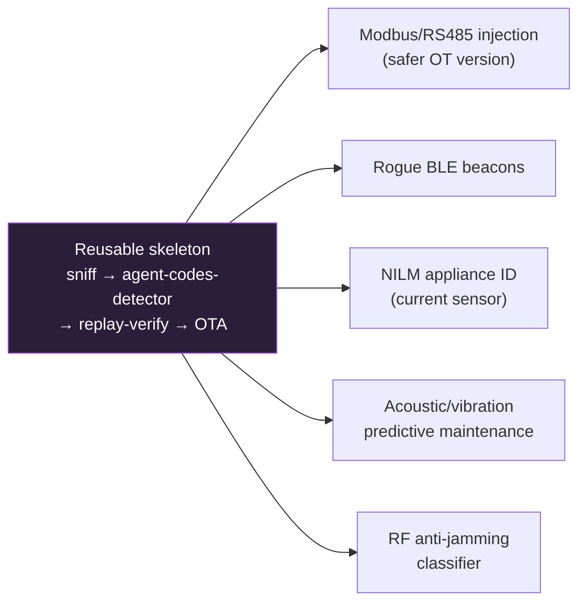

**Modbus/RS485** is the safest same-narrative fallback if RF sniffing proves flaky: passive tap, canonical OT protocol, bad frames replayed on your own bus, identical loop.

---

## 12. Biggest risks

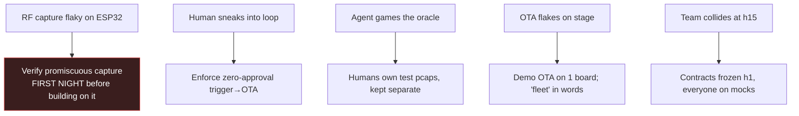

---

### TL;DR
You own the spine (FastAPI backend + orchestrator + WebSocket) and the dashboard. Freeze 4 data contracts in hour 1, build everything on a mock event generator, swap to real sources at integration. The dashboard visualizing the autonomous loop is the pitch. Never cut verification or autonomy.

---

## 13. Controlled Red ESP (safe synthetic radio demo)

The hardware demo uses a dedicated ESP32 as a bounded synthetic anomaly
generator. It does not change any frozen backend contract and never transmits
the embedded management frame as a real 802.11 deauthentication frame.

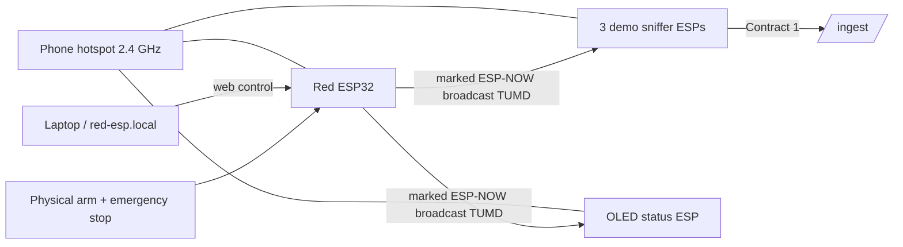

The `TUMD` envelope contains a simulation flag, run/sequence metadata, a logical
frame count, an embedded frame sample, and a checksum. For
`synthetic_deauth_flood`, the sample starts with the real deauth frame-control
bytes (`0xC0 0x00`), so the existing agent and C oracle operate on representative
input after a sniffer unwraps it. Over the air it remains a vendor-specific
ESP-NOW action frame and cannot disconnect Wi-Fi clients.

Selectable profiles are `synthetic_deauth_flood`, `traffic_spike`,
`sequence_replay`, `sequence_jump`, `identity_churn`, and `malformed_payload`.
No ESP IP/MAC allowlist is needed. Selection happens in a local web UI and
execution additionally requires a 1.5-second physical button hold. Runs stop
after at most 10 seconds and 500 physical packets. The default deauth profile
uses 10 physical packets/s × 80 logical frames, producing an 800 frames/s
anomaly without a real flood. See [ESP_DEMO.md](ESP_DEMO.md) for the complete
five-board runbook and [esp-attacker/README.md](esp-attacker/README.md) for the
transmitter.
