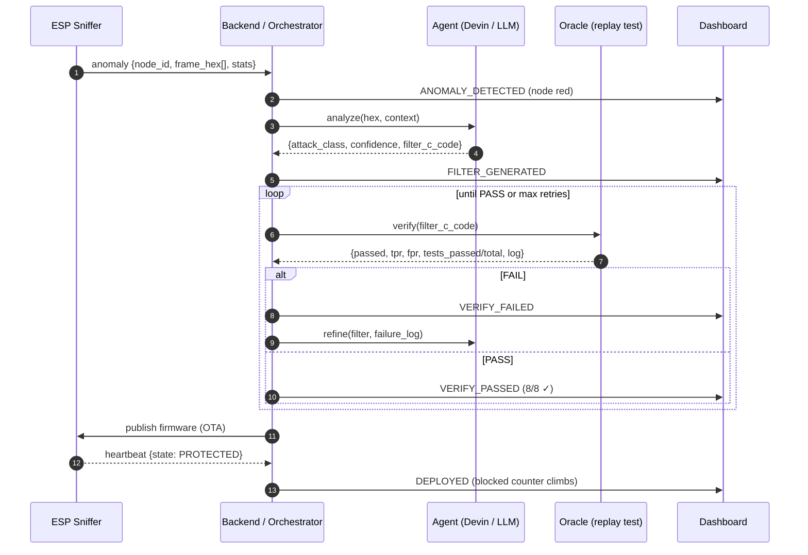
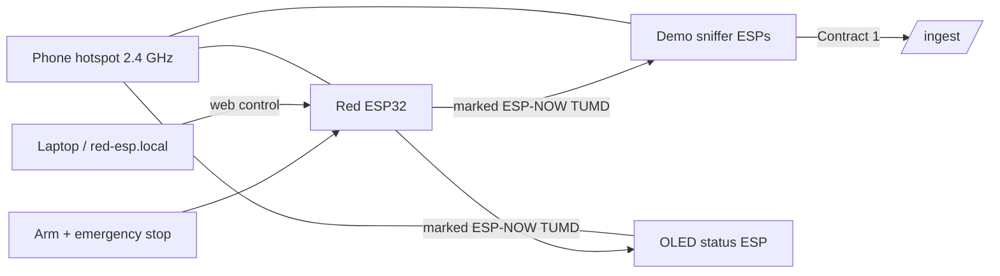

# Autonomous Anomaly Defense

> **Give the industry an engineer, not a copilot.** A crew of autonomous agents
> that **detect → analyze → write code → verify → deploy** with no human in the
> loop. Cheap ESP32 sniffers watch an industrial network; when something unknown
> appears, an AI agent reads the raw capture, *writes a C filter*, an independent
> oracle replay-proves it on held-out captures, and only then is it pushed OTA.

**Four agents. Zero easy targets.** One coordinator sits above three specialists
that each close their own loop across a different attack surface — the radio, the
browser and the inbox — and roll their evidence up into company-level
intelligence.

| Agent | Surface | What it does |
|---|---|---|
| 🛰️ **SIGNAL** | Network / radio edge | Detects hostile traffic, writes a C filter, proves it with the oracle, deploys it OTA — autonomously. |
| 🔍 **SCOPE** | Browser / links | Checks links, domains and page signals right where the click decision happens. |
| ✉️ **INBOX** | Email (Gmail) | Scans messages and attachments for impersonation, pressure tactics and malicious intent. |
| 🧠 **COMMANDER** | Cross-domain | Correlates the crew's evidence, researches campaigns and autonomously writes verified reports. |

Deauth is just the first example. The skeleton generalizes to **any radio/bus
anomaly** (disassoc, beacon flood, auth flood, Modbus injection, rogue BLE…).

Full design: **[ARCHITECTURE.md](ARCHITECTURE.md)**. Rules for humans and agents:
**[AGENTS.md](AGENTS.md)**.

---

## Why it wins

| Criterion | How we hit it |
|---|---|
| **Autonomy** (a layer, not a copilot) | Full loop with zero human approval: trigger → agent → verify → OTA. |
| **Verification** (a hard oracle) | Replay test: attack capture (must catch ~100%) + benign capture (must block 0). Machine-scored in seconds. |
| **Clarity** | The dashboard visualizes the whole loop live — the money shot. |

**The oracle is the core.** Attack = data (hex frames). Defense = code (a C
predicate over frame bytes). Verification = replay both labeled sets and count
TPR/FPR. A filter passes only at **`FPR == 0` and `TPR == 1`** — no threshold to
relax.

---

## The autonomous loop



There is **no human between the agent and OTA deploy**. That is what makes this a
defense layer instead of a copilot ([AGENTS.md](AGENTS.md) rule 6).

---

## Quickstart

Two processes, no database, no Docker.

```bash
make doctor    # tools, pins, ports — before anything else
make setup     # uv sync + npm install
make check     # the gate: ruff, ty, pytest, clang oracle, oxlint, tsc, vitest
```

```bash
cd backend && uv run uvicorn app.main:app --reload --port 8000
cd dashboard && npm run dev        # http://localhost:5173
```

Mock loops are **on by default**, so the full loop (real orchestrator, real
`clang` compile, real oracle replay) runs with **zero hardware**. A tile walks
`NORMAL → ALERT → UPDATING → PROTECTED` within ~15 s of boot. Turn mocks off as
real nodes come online: `MOCK=0`, or `MOCK_HEARTBEAT=0` / `MOCK_ANOMALY=0`.

See [`.claude/skills/run-dev`](.claude/skills/run-dev) for the demo runbook and
the mock flags.

---

## The dashboard — the money shot

React/Vite live view at `http://localhost:5173`, one route per agent:

| Route | View | Feed |
|---|---|---|
| `#/network` | **SIGNAL** — node grid, live loop timeline, ops counters | WS `/live` |
| `#/phishing` | **SCOPE** — link/domain investigations | HTTP + JSONL history |
| `#/mail` | **INBOX** — Gmail analyses and human-review queue | WS `/v1/email/live` |
| `#/command` | **COMMANDER** — cross-domain reports and evidence ledger | HTTP `/v1/command` |

The reducer is a pure WS-event fold, unit-tested without React
([`dashboard/src/reducer.ts`](dashboard/src/reducer.ts)).

---

## Hardware & ESP demo

A dedicated **Red ESP32** acts as a *bounded synthetic anomaly generator*. It
never transmits a real 802.11 deauth frame — it broadcasts a marked
vendor-specific ESP-NOW envelope (`TUMD`) that sniffers unwrap into representative
input for the agent and oracle. Selection happens in a local web UI **and**
requires a 1.5 s physical button hold; runs stop after at most 10 s / 500 packets.



| Board | Directory | Role |
|---|---|---|
| Red ESP32 | [`esp-attacker/`](esp-attacker/) | Bounded synthetic anomaly generator + web control panel (English). |
| Sniffer | [`esp-sniffer-demo/`](esp-sniffer-demo/) | ESP-NOW → HTTP bridge, POSTs to `/ingest` + `/heartbeat`. |
| OLED monitor | [`esp-oled-monitor/`](esp-oled-monitor/) | Local alarm display (`ATTACK!` / `NO ATTACK`). |
| Shared protocol | [`esp-common/`](esp-common/) | The marked synthetic-frame (`TUMD`) protocol. |
| Status terminal | [`firmware/esp32-display/`](firmware/esp32-display/) | Waveshare ESP32-S3 round LCD showing the authoritative aggregate state (`SAFE` / `ATTACK` / `NO DATA`). |
| Sniffer firmware | [`firmware/esp32-sniffer/`](firmware/esp32-sniffer/) | Promiscuous capture firmware + host tests. |

Full five-board runbook: **[ESP_DEMO.md](ESP_DEMO.md)**. No-hardware edge
enforcement demo: **[EDGE_DEMO.md](EDGE_DEMO.md)**. ESP validation notes:
[docs/ESP_ARCHITECTURE_REVIEW.md](docs/ESP_ARCHITECTURE_REVIEW.md).

---

## Data contracts (frozen)

Six contracts + the WS event schema are the single source of truth, mirrored in
[`backend/app/models.py`](backend/app/models.py) and
[`dashboard/src/types.ts`](dashboard/src/types.ts). Full JSON in
[ARCHITECTURE.md §4](ARCHITECTURE.md).

1. **ESP → `/ingest`** — anomaly (hex frames + stats)
2. **ESP → `/heartbeat`** — liveness (`NORMAL | ALERT | PROTECTED | UPDATING | OFFLINE`)
3. **Backend ↔ Agent** — hex → `{attack_class, confidence, filter_c_code, explanation}`
4. **Backend ↔ Oracle** — `filter_c_code` → `{passed, tpr, fpr, tests_passed/total, log}`
5. **Gmail threat review** — isolated Pub/Sub → durable analysis → `/v1/email/live`
6. **COMMAND cross-domain intelligence** — evidence ledger → autonomous verified reports

Changing a contract touches five files at once — see
[`.claude/skills/change-contract`](.claude/skills/change-contract).

### Selected endpoints

| Method | Path | Purpose |
|---|---|---|
| POST | `/ingest` | Anomaly intake (Contract 1) |
| POST | `/heartbeat` | Node liveness (Contract 2) |
| GET | `/nodes` | Fleet snapshot (dashboard bootstrap) |
| GET | `/firmware/{node_id}` | OTA fetch latest firmware |
| WS | `/live` | Event stream to the dashboard |
| GET/WS | `/v1/hmi/status`, `/v1/hmi/live` | Status terminal contract + stream |
| — | `/v1/email/*` | Gmail connect, import, analyses, review, live |
| — | `/v1/command/*` | Cross-domain overview, reports (JSON + Markdown) |

---

## What is enforced, not just described

- `make check` is the gate, and CI runs exactly that target — nothing else.
- `tests/test_contract_sync.py` parses `dashboard/src/types.ts` and fails when a
  backend contract drifts from `backend/app/models.py`.
- `tests/test_layering.py` fails if the agent side can reach the oracle, the
  orchestrator, or the held-out fixtures — verification stays honest.
- The oracle passes a filter only at `FPR == 0` and `TPR == 1`. No threshold to
  relax ([AGENTS.md](AGENTS.md) rule 3).
- The status-terminal firmware has its own CI for native state tests and both
  Waveshare builds.

---

## Repository layout

| Path | What |
|---|---|
| [`backend/app/models.py`](backend/app/models.py) | Frozen contracts + WS event, as pydantic |
| [`backend/app/orchestrator.py`](backend/app/orchestrator.py) | The backend state machine |
| [`backend/app/oracle.py`](backend/app/oracle.py) | Compiles + replay-tests candidate filters |
| [`backend/oracle/`](backend/oracle/) | `harness.c`, sample `filters/`, held-out `fixtures/` |
| [`backend/app/agent_stub.py`](backend/app/agent_stub.py) / `agent_devin.py` | Agent call — stub and Devin-backed, same contract |
| [`backend/app/email_*.py`](backend/app/), `gmail_client.py` | INBOX: Gmail intake, analysis, store |
| [`backend/app/command_*.py`](backend/app/), `scope_log.py` | COMMAND + SCOPE: reports, evidence ledger, OSINT history |
| [`dashboard/src/`](dashboard/src/) | React views + pure, unit-tested reducers per domain |
| [`esp-attacker/`](esp-attacker/), `esp-sniffer-demo/`, `esp-oled-monitor/`, `esp-common/` | ESP-NOW demo boards + shared protocol |
| [`firmware/`](firmware/) | Waveshare status terminal + sniffer firmware and host tests |

---

## Optional integrations

- **Devin** as the real agent — [docs/GMAIL_SETUP.md](docs/GMAIL_SETUP.md) covers
  the Gmail + Devin setup; `agent_devin.py` / `devin_client.py` back the loop.
- **Gmail** for INBOX — OAuth + Cloud Pub/Sub push; no email is deleted, moved or
  reported as Spam automatically — flagged items require a human decision.

---

## Agent & developer workflows

Repeatable workflows and their foot-guns are written down, not remembered:

- [`.claude/skills/run-checks`](.claude/skills/run-checks) — every gate, and what each does not cover.
- [`.claude/skills/run-dev`](.claude/skills/run-dev) — running the demo, mock flags, why the WS goes quiet.
- [`.claude/skills/write-filter`](.claude/skills/write-filter) — the exact contract `oracle/harness.c` enforces.
- [`.claude/skills/change-contract`](.claude/skills/change-contract) — the five files a contract change touches.
- [`.claude/commands/`](.claude/commands/) — `/research`, `/deslop`.

**Before finishing any task or committing, run `make check` and make it green.**
Never weaken a check to make it pass ([AGENTS.md](AGENTS.md)).
