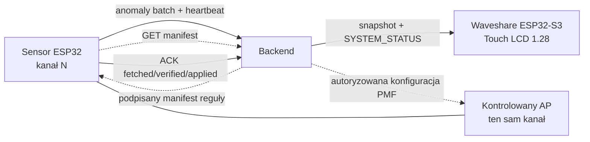

# Walidacja architektury ESP

## Werdykt

Część ESP jest wykonalna jako adaptacyjny IDS: sensory pasywnie wykrywają
anomalie, a osobny ESP32-S3 z ekranem pokazuje zagregowany status backendu.
ESP pracujący w trybie promiscuous odbiera kopie ramek, ale nie zatrzyma deauth
wysłanego do innych klientów. Dla tego scenariusza realna prewencja wymaga
kontrolowanego AP oraz wymuszonego PMF/802.11w na AP i zgodnych klientach.
Firewall lub gateway nie filtruje ramek zarządzających 802.11; może być punktem
egzekwowania dopiero dla osobnego scenariusza ruchu routowanego albo magistrali.

## Ograniczenia i wiążące decyzje

| Priorytet | Problem | Decyzja / korekta |
|---|---|---|
| P0 | Predykat pasywnego ESP nie blokuje ramek w eterze | Używać `matches_attack()` i `attack_frames_detected`; stan polityki `APPLIED` oznacza detekcję, a potwierdzenie remediacji może pochodzić tylko z kontrolowanego AP |
| P0 | Bezstanowy predykat jednej ramki nie wykrywa floodu | Reguła musi mieć klucz agregacji, próg i okno czasowe; oracle odtwarza oryginalne odstępy |
| P0 | Kod wykonywalny generowany przez LLM tworzy ryzyko RCE/UB/DoS | Stały firmware interpretuje ograniczony manifest reguł; OTA firmware jest osobnym, kontrolowanym procesem z podpisem, canary, A/B i rollbackiem |
| P0 | Jedno radio ESP nie skanuje wielu kanałów, utrzymując stabilne Wi-Fi | Demo: jeden BSSID i jeden stały kanał zgodny z kanałem AP; produkcyjnie sensory per kanał lub drugi transport |
| P0 | Brak uwierzytelnienia ingest/heartbeat/policy/OTA | HTTPS, tożsamość per urządzenie, ochrona replay, podpis manifestu i obrazu |
| P1 | `frame_hex[]` nie zachowuje metadanych per ramka | Dodać `offset_us`, RSSI, kanał, długości, FCS/truncation i jednoznaczny link type |
| P1 | Callback promiscuous może zostać zagłodzony przez flood | Tylko bounded copy do statycznej kolejki; parser, agregacja i HTTP w osobnym tasku |
| P1 | Jedno pole stanu miesza łączność, zagrożenie i wdrożenie | Rozdzielić connectivity, threat, policy i firmware; `OFFLINE` wylicza backend |
| P1 | HMI wymaga trwałego źródła stanu i reguły czyszczenia alarmu | Snapshot `/v1/hmi/status` + pełny `SYSTEM_STATUS`, TTL, `stream_generation`, `stream_id`, `seq`; tylko późniejszy autorytatywny `SAFE` czyści alarm |
| P1 | Push OTA i endpoint GET są niejednoznaczne | Stosować pull manifest i ACK etapów: `downloaded`, `verified`, `booted`, `healthy`, `rolled_back` |

Pełne twierdzenie „detection is 100% passive and legal” także jest zbyt szerokie.
Legalność monitoringu i przetwarzania identyfikatorów zależy od miejsca, celu i
jurysdykcji.

## Zalecana topologia demo



Sensor, terminal HMI i punkt egzekwowania to trzy odrębne role. Terminal z
ekranem nie powinien równocześnie sniffować; dzięki temu utrata kanału radiowego
sensora nie blokuje prezentacji stanu całej floty. Dla deauth jedynym punktem
remediacji w tej topologii jest kontrolowany AP, przy czym PMF musi być wymagane
i obsługiwane także przez klientów.

## Model danych sensora

Zamiast wspólnego `timestamp` i `rssi` dla tablicy ramek:

```json
{
  "schema_version": 1,
  "event_id": "evt-7",
  "node_id": "esp-03",
  "boot_id": "boot-a91f",
  "seq": 184,
  "uptime_ms": 913245,
  "capture": {
    "bssid": "aa:bb:cc:dd:ee:ff",
    "channel": 6,
    "link_type": "IEEE802_11_MPDU_NO_RADIOTAP",
    "fcs_included": false
  },
  "frames": [{
    "offset_us": 0,
    "hex": "c0003a01...",
    "rssi": -52,
    "original_len": 26,
    "captured_len": 26
  }],
  "anomaly": {
    "frame_type": "mgmt",
    "subtype": 12,
    "count_in_window": 240,
    "window_ms": 1000
  },
  "queue_drops": 0
}
```

Należy zamrozić maksymalną liczbę ramek, `snaplen`, maksymalny rozmiar requestu
i sposób batchowania. Oracle musi używać tych samych bajtów MPDU oraz tych samych
odstępów czasowych co firmware.

## Rozdzielony heartbeat

Heartbeat nie ma jednego pola stanu. Raportuje niezależnie zagrożenie, aktywną
politykę, stan kontrolowanego OTA firmware i metryki zdrowia:

```json
{
  "schema_version": 1,
  "node_id": "esp-03",
  "boot_id": "boot-a91f",
  "seq": 185,
  "uptime_ms": 918245,
  "threat": {"level": "ALERT", "active_alerts": 1,
             "attack_frames_detected": 247},
  "policy": {"policy_id": "pol-42", "version": 7, "state": "APPLIED"},
  "firmware": {"version": "1.0.0", "ota_state": "IDLE"},
  "health": {"frames_seen": 10432, "queue_drops": 0}
}
```

Backend wylicza `ONLINE/OFFLINE` z wieku heartbeatów. `policy.state=APPLIED`
potwierdza działanie detektora, nie ustanie ataku ani ochronę ruchu.

## Ograniczona polityka detekcji

Jedynym dozwolonym wyjściem agenta jest walidowalny manifest danych:

```json
{
  "schema_version": 1,
  "policy_id": "pol-42",
  "target": "wifi80211",
  "expires_at": 1787000000,
  "rules": [{
    "frame_type": "mgmt",
    "subtype": 12,
    "bssid": "aa:bb:cc:dd:ee:ff",
    "key_by": ["bssid", "sender"],
    "threshold": 20,
    "window_ms": 1000,
    "action": "ALERT"
  }],
  "sha256": "...",
  "signature": "..."
}
```

Interpreter na ESP ma skończony zestaw operatorów, limity CPU/pamięci i
odrzuca niepodpisane lub wygasłe reguły. OTA całego firmware pozostaje osobnym,
kontrolowanym procesem.

## Dystrybucja polityki i firmware

Sensor sam pobiera politykę z `GET /v1/policies/{node_id}/manifest`, sprawdza
schemat, czas ważności, digest i podpis, a następnie wysyła do
`POST /v1/policies/{node_id}/ack` etapy `fetched`, `verified`, `applied` lub
`rejected`. Zastosowanie polityki nie oznacza, że atak ustał.

OTA firmware nie należy do pętli agenta. Urządzenie pobiera kontrolowany
manifest z `GET /v1/firmware/{node_id}/manifest`, następnie niezmienny,
podpisany obraz do nieaktywnej partycji A/B. ACK raportuje `downloaded`,
`verified`, `booted`, `healthy` albo `rolled_back`; backend ogłasza sukces dopiero
po `healthy`. Brak self-testu lub timeout uruchamia rollback.

## Kontrakt HMI

Autorytatywny snapshot to `GET /v1/hmi/status`; jego pełny schemat i event
WebSocket są opisane w
[README firmware](../firmware/esp32-display/README.md#kontrakt-http).

Zasady redukcji stanu:

1. Boot bez snapshotu oznacza `UNKNOWN`, nigdy `SAFE`.
2. `SAFE` wymaga świeżego TTL, `active_alerts == 0`,
   `sensors.expected > 0` i kompletu sensorów online.
3. Tylko pełny snapshot HTTP lub `SYSTEM_STATUS.payload` może zmienić stan
   HMI. Eventy pipeline, w tym `ANOMALY_DETECTED`, `POLICY_ACK` i
   `REMEDIATION_APPLIED`, są ignorowane; każda zmiana zagrożenia musi wywołać
   nowy `SYSTEM_STATUS`.
4. Snapshot wymaga dodatniego `stream_generation`, niepustego `stream_id` i
   `seq`. Backend trwale zwiększa generację przed każdym nowym procesem, a `seq`
   rośnie przy każdej zmianie agregatu bezpieczeństwa.
5. Firmware odrzuca starszą generację, cofnięte `seq`, inny `stream_id` w tej
   samej generacji oraz sprzeczną treść przy równym `seq`. Identyczny snapshot
   HTTP o równym `seq` może wyłącznie odświeżyć TTL.
6. Tylko późniejszy autorytatywny `SAFE` może wrócić do zielonego widoku;
   po restarcie backend zaczyna od `UNKNOWN`, dopóki nie odtworzy incydentów i
   stanu floty.
7. Po utracie backendu znany alarm pozostaje czerwony z etykietą starych danych;
   poprzedni `SAFE` wygasa do `BRAK DANYCH`.

## Co należy jeszcze wdrożyć po stronie sensorów

- statyczny ring buffer i osobny task przetwarzania;
- jawny jeden kanał/BSSID dla demo;
- temporalny interpreter reguł;
- HTTPS z tożsamością per urządzenie i ochroną replay;
- manifest polityki z podpisem i wersją;
- limity payloadu, backpressure, deduplikacja i retry z jitterem;
- watchdog, health metrics i testy na dokładnym wariancie chipa;
- pull/ACK dla polityki;
- kontrolowane OTA A/B z walidacją nowego obrazu, ACK zdrowia i rollbackiem.

Oficjalna dokumentacja Espressif opisuje
[tryb Wi-Fi sniffer i callback wykonywany w tasku sterownika](https://docs.espressif.com/projects/esp-idf/en/stable/esp32s3/api-guides/wifi-driver/wifi-modes.html),
[API Wi-Fi ESP32-S3](https://docs.espressif.com/projects/esp-idf/en/stable/esp32s3/api-reference/network/esp_wifi.html)
oraz [OTA z rollbackiem](https://docs.espressif.com/projects/esp-idf/en/stable/esp32s3/api-reference/system/ota.html).
