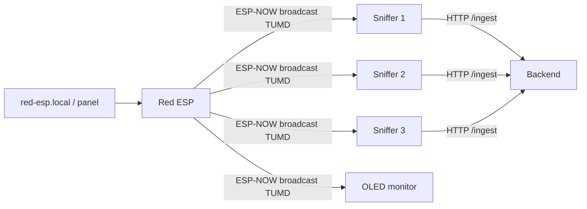

# Red ESP32 — bezpieczny generator syntetycznych ataków

Red ESP jest fizycznym nadajnikiem demo. Łączy się z hotspotem `LAB_*`, a
następnie wysyła oznaczone broadcasty ESP-NOW do wszystkich urządzeń na tym
samym kanale. Nie zna IP ani MAC snifferów i nie nadaje prawdziwych ramek
deauthentication.

Profil `synthetic_deauth_flood` umieszcza poprawnie zbudowane bajty ramki deauth
**wewnątrz** nieszkodliwej ramki vendor-specific ESP-NOW. Odbiornik rozpoznaje
magic `TUMD`, weryfikuje checksumę i dopiero wtedy przekazuje osadzone bajty do
backendu jako `frame_hex`. Dzięki temu agent i oracle dostają realistyczny
materiał, ale żaden klient Wi-Fi nie jest rozłączany.



Przy ustawieniu domyślnym Red ESP nadaje 10 pakietów demo/s, a każdy reprezentuje
80 logicznych ramek deauth. Sniffer raportuje więc około 800 ramek/s, mimo że
fizycznie powstaje tylko lekki ruch ESP-NOW.

## Konfiguracja i flashowanie

```powershell
cd esp-attacker
Copy-Item include\lab_secrets.example.h include\lab_secrets.h
notepad include\lab_secrets.h
uvx --from platformio platformio run -e esp32dev --target upload
uvx --from platformio platformio device monitor --baud 115200
```

Hotspot musi działać w paśmie 2,4 GHz i mieć nazwę zaczynającą się od `LAB_`.
Panel jest dostępny z urządzenia w tym samym hotspocie pod
`http://red-esp.local`; awaryjnie Red ESP wystawia też AP `RED-ESP-*` z panelem
pod `http://192.168.4.1`. Login panelu to `redesp`, a hasło pochodzi z
`LAB_CONTROL_PASSWORD`.

Scenariusz wymaga przytrzymania BOOT przez 1,5 s i automatycznie kończy się po
10 sekundach. Naciśnięcie BOOT podczas działania jest natychmiastowym STOP-em.

Na scenie najszybszy trigger to klawisz **`T`** w monitorze szeregowym
(`pio device monitor`): jedno naciśnięcie samo uzbraja i odpala jeden scenariusz,
kolejne `T` zatrzymuje go wcześniej. Wszystkie bezpieczniki (blokada `LAB_`,
połączenie z hotspotem, gotowość ESP-NOW, walidacja profilu) nadal obowiązują.

Pełny runbook dla nadajnika, trzech snifferów, OLED i backendu znajduje się w
[ESP_DEMO.md](../ESP_DEMO.md).
